# Adaptive Gripper with Micro-Vibration Based Slip Detection

A complete mechatronics project featuring a parallel gripper with real-time slip detection using a 3D magnetic sensor (TLV493D) and FFT-based signal analysis. The system autonomously adjusts grip force by detecting incipient slip through micro-vibration analysis, preventing object loss while minimizing applied force.

**Author:** Dušan Grković  
**Mentor:** Prof. Dr. Zoran Jeličić  
**Institution:** Faculty of Technical Sciences, Novi Sad  
**Date:** 2025

> All components of this project (PCB layout, firmware, and desktop application) were developed by the author. The mechanical design is based on [1] with significant modifications for sensor integration.

<p align="center">
  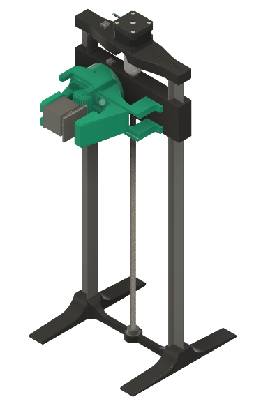
</p>


## Table of Contents

1. [Overview](#overview)
2. [System Architecture](#system-architecture)
3. [Hardware](#hardware)
   - [Mechanical Design](#mechanical-design)
   - [Sensor Element](#sensor-element)
   - [Automated Test Platform](#automated-test-platform)
   - [Electronics](#electronics)
4. [Firmware](#firmware)
   - [Architecture](#firmware-architecture)
   - [Signal Processing](#signal-processing)
   - [State Machine](#state-machine)
5. [Communication Protocol](#communication-protocol)
6. [Desktop Application](#desktop-application)
7. [Test Results](#test-results)
8. [Hardware Files](#hardware-files)
9. [Repository Structure](#repository-structure)
10. [Build Instructions](#build-instructions)
11. [References](#references)

## Overview

This project presents a novel approach to adaptive grip force control where the conventional strain gauge based system is replaced with a contactless 3D magnetic sensor. The system detects the onset of slippage (incipient slip) by analyzing micro-vibrations generated during the stick-slip phenomenon.

### Key Features

- Real-time slip detection using FFT spectral analysis (40 Hz to 120 Hz band)
- Contactless measurement using TLV493D 3D Hall effect sensor
- Custom elastic sensor element with optimized natural frequency (~180 Hz)
- Dual-core FreeRTOS implementation on ESP32 (2 kHz sampling rate)
- Automated test platform with sensorless homing using TMC2209
- Desktop application for signal visualization and parameter tuning

### Operating Principle

1. **Stick-Slip Effect:** When an object begins to slip, the contact surface undergoes cycles of sticking and releasing, generating characteristic high-frequency vibrations
2. **Mechanical Transduction:** A custom elastic mechanism (planar spiral flexure) converts surface micro-displacements into magnet movement
3. **Magnetic Sensing:** The TLV493D sensor measures the magnet position changes caused by vibrations
4. **Spectral Analysis:** Real-time FFT identifies the spectral signature of slippage
5. **Adaptive Control:** A finite state machine increases grip force proportionally to slip intensity

## System Architecture

<p align="center">
  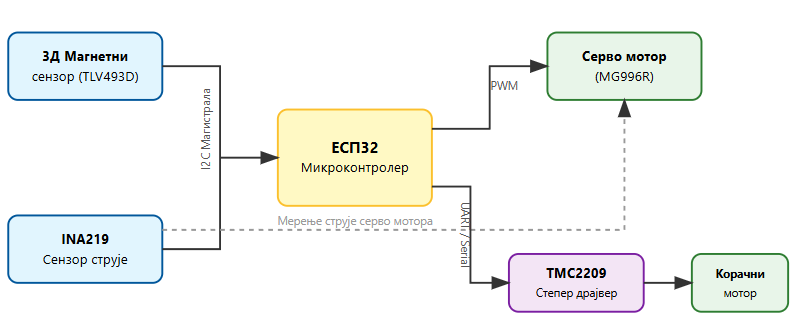
</p>

The system consists of three main subsystems:

| Subsystem | Components | Function |
|-----------|------------|----------|
| Sensing | TLV493D magnetic sensor, INA219 current sensor | Measure deformation and motor current |
| Control | ESP32 microcontroller, FreeRTOS | Real-time signal processing and decision making |
| Actuation | MG996R servo motor, NEMA17 stepper | Gripper actuation and test platform movement |

## Hardware

### Mechanical Design

The parallel gripper uses a rack and pinion mechanism for linear motion transformation. One finger is active (moving) while the other is passive (stationary) with the integrated sensor element.

**Note:** The mechanical design of the gripper is based on the open-source "Robot-manipulator" project by AnnaW21 [1], with significant modifications to integrate the custom sensor element and optimize it for the specific requirements of this project.

<p align="center">
  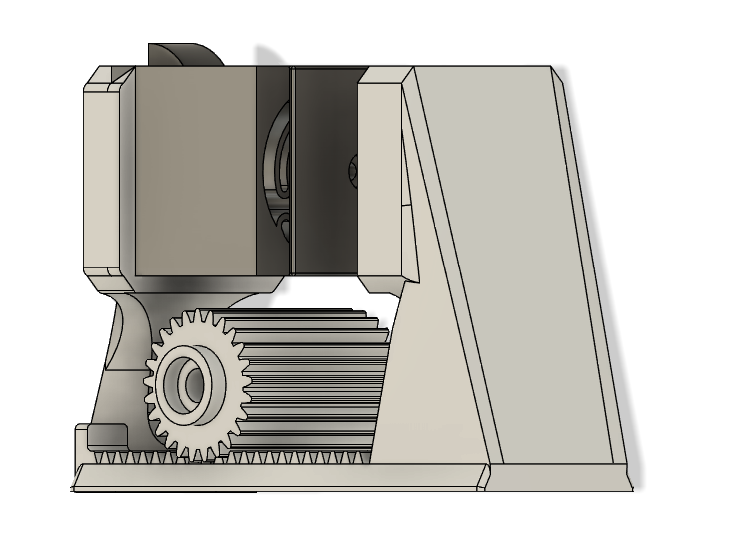
</p>

**Key specifications:**

- Material: PETG (FDM 3D printed)
- Actuator: MG996R servo motor (11 kg·cm torque at 6V)
- Drive: Rack and pinion with metal gears
- Contact surface: TPU insert for increased friction coefficient

CAD files are available in the `hardware/gripper/` directory as STEP format.

### Sensor Element

The elastic sensor element is the core innovation of this project. It uses a planar spiral flexure geometry that acts as a 3-DOF spring with the magnet mounted at the center.

<p align="center">
  
</p>

**Design parameters:**

- Geometry: 3-arm symmetric planar spiral flexure
- Natural frequency: ~180 Hz (tuned above slip detection band)
- Air gap: 4 mm between magnet and sensor
- Lever amplification: Geometry amplifies small displacements at contact surface

The natural frequency was empirically tuned through 10+ iterations using impulse response testing.

### Automated Test Platform

To ensure repeatable experimental conditions and eliminate operator subjectivity, a dedicated vertical positioning system was designed and built.

<p align="center">
  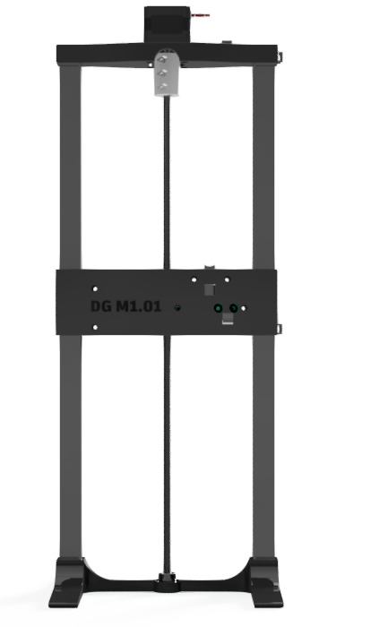
  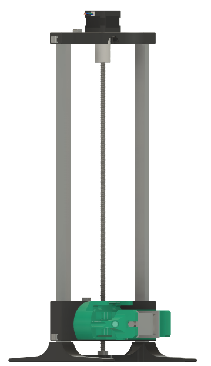
</p>

**Purpose:** Manual lifting introduces inconsistent accelerations and mechanical vibrations that can mask the slip signal or cause false detections. This platform guarantees identical velocity profiles across all test cycles. The use of this platform eliminates human variability in lifting speed and stability, which is essential for validating the sensitivity of the slip detection algorithm.

**Construction:**

- Frame: Aluminum T extrusion 
- Drive: M8x1.25mm lead screw coupled to NEMA17 stepper motor
- Controller: TMC2209 driver with StallGuard4 for sensorless homing
- Resolution: 2560 steps/mm (16 microsteps, 1.8 degree motor)

**Sensorless Homing Algorithm:**

Instead of physical limit switches, the system uses the TMC2209's StallGuard feature to detect when the platform reaches the mechanical stop:

1. Reduce motor current to 500mA (prevents damage on collision)
2. Move upward briefly (ensures room for acceleration)
3. Move downward while polling SG_RESULT via UART
4. When load increases (SG_RESULT drops below threshold for 3 consecutive reads), stop and set position to zero
5. Restore nominal current and acceleration parameters

CAD files available in: `hardware/lifting platform/lifter.step`

### Electronics

<p align="center">
  
</p>

The electronic system is built around an ESP32 development module with the following interfaces:

| Component | Interface | Function |
|-----------|-----------|----------|
| TLV493D | I2C (1 MHz) | 3D magnetic field measurement |
| INA219 | I2C | Servo motor current sensing |
| MG996R | PWM (50 Hz) | Gripper actuation |
| TMC2209 | UART + Step/Dir | Stepper motor control with StallGuard |
| Buttons (x5) | GPIO | Manual control interface |

**Button Functions:**

Five tactile buttons (active low with internal pull-up resistors) provide manual control:

| Button | Function |
|--------|----------|
| SW1 | Start adaptive gripping (grasp with optimal force) |
| SW2 | Full gripper open |
| SW3 | Raise platform to predefined height |
| SW4 | Lower platform to home position |
| SW5 | Emergency stop (halt platform at current position) |

**Power supply:** Single 7V input with bulk capacitors (2x 3300μF) for motor transient filtering.

Complete schematic available at: `hardware/pcb/Schematic_Gripper_diplomski.pdf`

PCB design files (EasyEDA format) available in: `hardware/pcb/EasyEda/`

## Firmware

### Firmware Architecture

The firmware implements a deterministic control loop using FreeRTOS on ESP32's dual-core architecture.

<p align="center">
  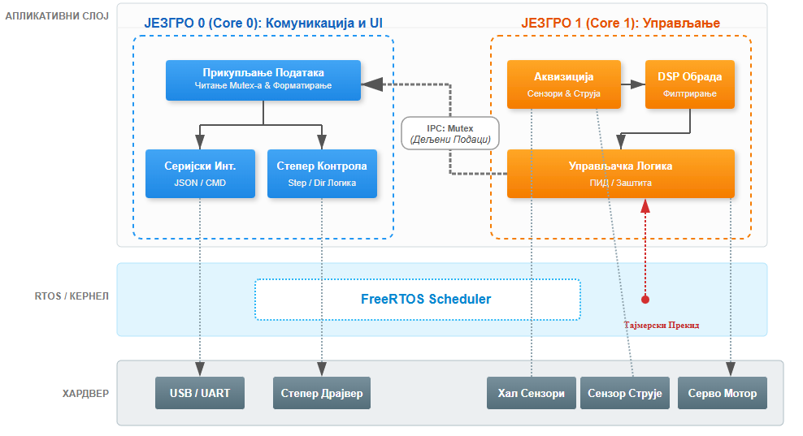
</p>

**Core assignment:**

- **Core 0:** Communication task (telemetry, debug interface)
- **Core 1:** Real-time control loop (sensor acquisition, DSP, state machine)

Inter-core data sharing is protected by mutex to prevent race conditions.

### Scan Cycle

The main loop follows a PLC-style scan cycle triggered by hardware timer at 2 kHz:

1. **Read Inputs:** Magnetic sensor (2 kHz), current sensor (100 Hz), buttons (20 Hz)
2. **Process Logic:** Digital filtering, FFT computation, slip detection, FSM update
3. **Write Outputs:** Servo PWM update if position changed

### Signal Processing

<p align="center">
  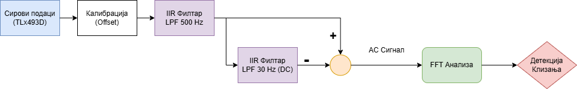
</p>

The signal processing pipeline:

1. **Calibration:** Offset removal based on startup readings
2. **Low-pass Filter (500 Hz):** Sensor noise elimination
3. **Band-split Filter (30 Hz):** Separates DC (grip force) from AC (vibrations)
4. **High-pass Filter:** AC component extraction by subtraction
5. **FFT Analysis:** 128-sample window, spectral power computation

**Slip indicator calculation:**

```
slip_indicator = frequency_weighted_power(40 Hz to 120 Hz band)
```

The frequency weighting gives higher importance to higher frequency components characteristic of slip events.

### State Machine

<p align="center">
  
</p>

The gripper control FSM has five states:

| State | Entry Condition | Behavior |
|-------|-----------------|----------|
| OPEN | Default / Button 2 | Gripper fully open |
| OPENING | Release command | Gradual opening |
| GRASPING | Button 1 | Close until contact detected (magnitude > threshold) |
| HOLDING | Contact established | Monitor for slip, maintain position |
| REACTING | Slip detected | Increase grip force proportionally |

## Communication Protocol

The firmware implements a bidirectional JSON-based protocol over serial (2000000 baud) for telemetry and configuration.

### Telemetry Output

Standard telemetry packet (fields depend on enabled streams):

```json
{"mlx":0.30,"mly":-0.46,"mlz":-0.28,"mag":0.71,"slip":0,"s_ind":1.76}
```

Each packet ends with a pipe character and XOR checksum for validation: `|5A`

### Configuration Commands

Send JSON commands to toggle specific data streams:

| Command | Description |
|---------|-------------|
| `{"fft": true/false}` | Exclusive FFT streaming mode (pauses other metrics) |
| `{"mag_lowpass": true/false}` | Low-pass filtered magnetic data (mlx, mly, mlz, mag) |
| `{"mag_highpass": true/false}` | High-pass filtered magnetic data (mhx, mhy, mhz) |
| `{"mag_raw": true/false}` | Raw magnetic sensor data (rmx, rmy, rmz) |
| `{"current": true/false}` | Current sensor reading (cur) |
| `{"slip": true/false}` | Slip detection status and indicator (slip, s_ind) |
| `{"servo": true/false}` | Servo position and grip mode (srv, grp) |
| `{"system": true/false}` | System timing diagnostics (t) |

### FFT Data Format

When FFT mode is enabled, spectral data is streamed as:

```json
{"type":"fft","data":[10.5, 2.3, 0.1, ...]}
```

The data array contains 64 magnitude values from the high-pass filtered signal.

Full protocol documentation: `firmware/Thesis_Gripper/debugCommands.md`

## Desktop Application

A Python-based desktop application was developed for real-time signal visualization and system tuning.

### Features

- Activation/deactivation of telemetry streams (reduces serial bus load)
- Serial port and baud rate selection
- Configurable Y-axis range with auto-scaling option
- Configurable X-axis window (samples)
- Automatic DC centering
- Data recording to file
- Playback of recorded data with adjustable speed
- XOR checksum validation
- Multiple plots in single window
- Signal appearance customization (color, thickness, line type)
- Export to standard formats (CSV, PNG, matplotlib, SVG)
- Threshold indicators for parameter tuning
- Real-time FFT view with spectrogram history

### Screenshots

**Real-time signal visualization:**

<p align="center">
  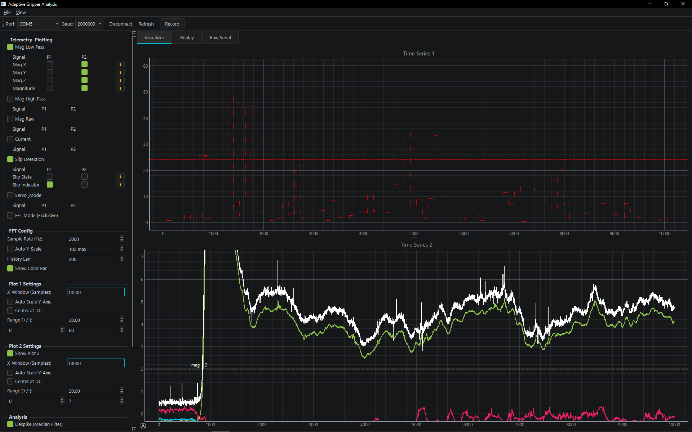
</p>

**Raw serial terminal:**

<p align="center">
  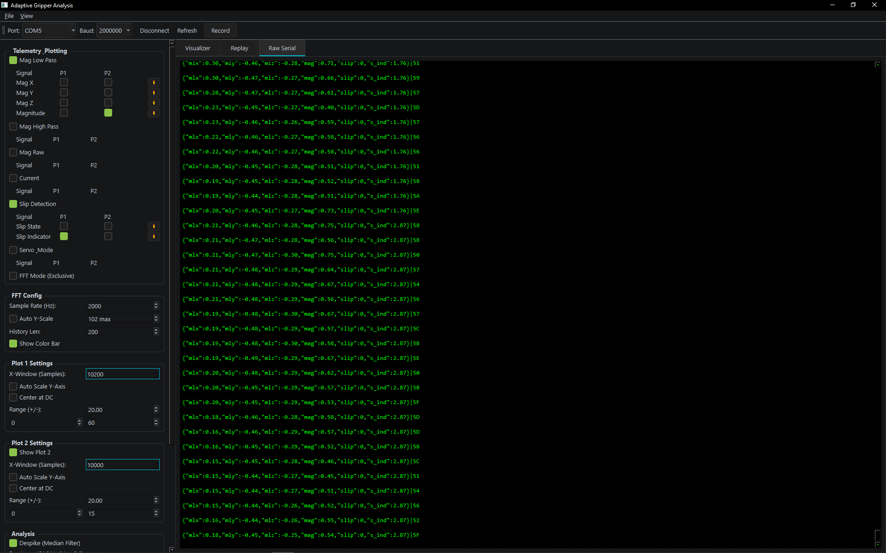
</p>

**Recorded data replay:**

<p align="center">
  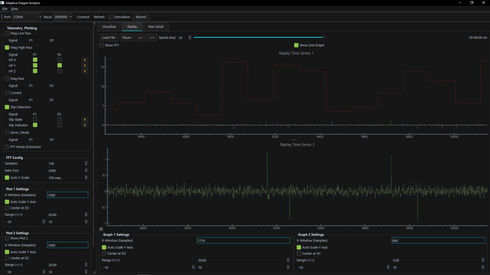
</p>

**FFT analysis with spectrogram:**

<p align="center">
  
</p>

## Test Results

The system was validated on various objects to demonstrate robustness and adaptability.

### Soft Objects (Sponge)

The gripper successfully grasped and held a deformable sponge with minimal compression (~5%), demonstrating the algorithm's ability to apply just enough force.

<p align="center">
  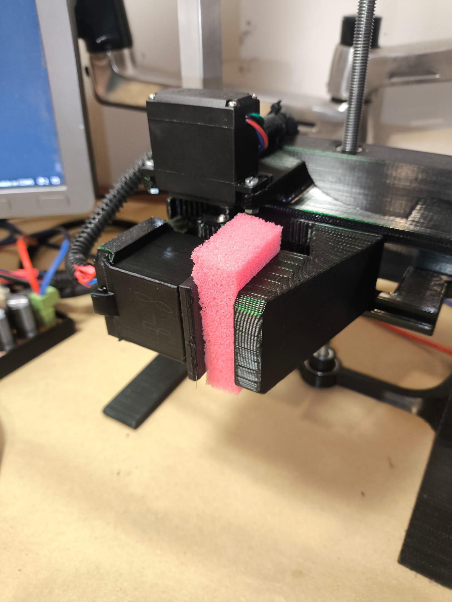
  
</p>

### Rigid Objects (Cardboard Box)

A thin cardboard box (155g) was held without visible wall deformation, confirming optimal force application.

<p align="center">
  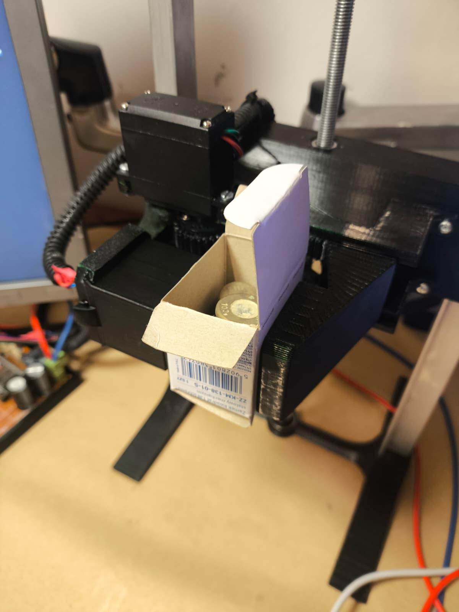
</p>

### Irregular Geometry (Cylindrical Object)

A 220g cylindrical tool was successfully held despite line contact instead of surface contact. Initial slip of ~10mm occurred during lifting transition before the system stabilized.

<p align="center">
  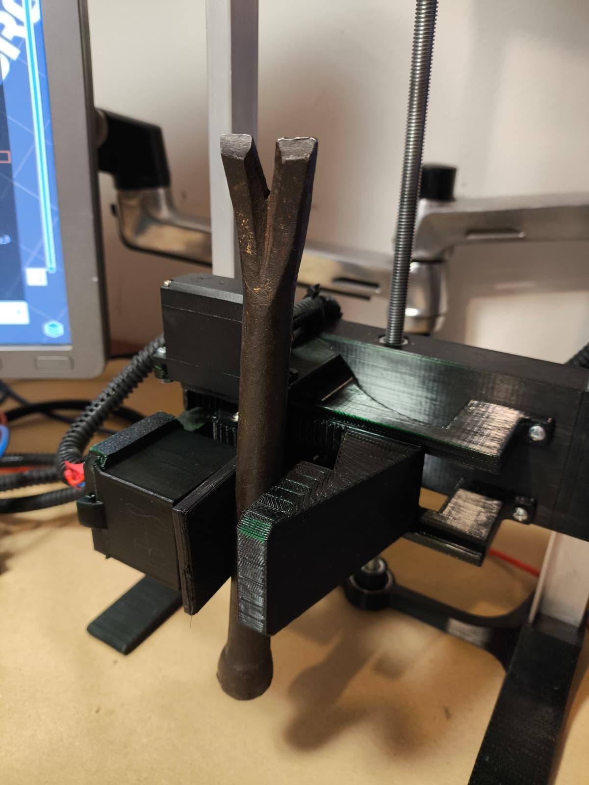
</p>

### Performance Metrics

| Parameter | Value |
|-----------|-------|
| Sampling frequency | 2000 Hz |
| FFT window | 128 samples (64 ms) |
| Minimum reaction time | ~90 ms (buffer fill + processing + motor response) |
| Slip detection band | 40 Hz to 120 Hz |
| Slip threshold | 30 (weighted spectral power) |
| Contact detection threshold | 2.0 mT (magnitude change) |

## Hardware Files

All mechanical and electronic design files are provided for replication:

### Mechanical (STEP format)

| File | Description |
|------|-------------|
| `hardware/gripper/gripper.step` | Complete gripper assembly including rack and pinion mechanism, sensor housing, and finger geometry |
| `hardware/lifting platform/lifter.step` | Vertical test platform with linear guides and lead screw mount |

### Electronics

| File | Description |
|------|-------------|
| `hardware/pcb/Schematic_Gripper_diplomski.pdf` | Full circuit schematic (printable) |
| `hardware/pcb/EasyEda/1-Schematic_Gripper_diplomski.json` | EasyEDA schematic source file |
| `hardware/pcb/EasyEda/1-PCB_PCB_Gripper_diplomski.json` | EasyEDA PCB layout source file |

The PCB was designed but not manufactured; the prototype uses perfboard construction.

## Repository Structure

```
Adaptive-Gripper-with-Micro-Vibration-Based-Slip-Detection/
├── firmware/
│   └── Thesis_Gripper/
│       ├── Thesis_Gripper.ino    # Main program
│       ├── debugCommands.md               # Serial protocol documentation
│       └── src/
│           ├── Config.h                    # System configuration
│           ├── Types.h                     # Data structures
│           ├── Globals.h/.cpp              # Shared variables
│           ├── Drivers/                    # Hardware abstraction
│           │   ├── MagneticSensor.*        # TLV493D driver
│           │   ├── CurrentSensor.*         # INA219 driver
│           │   ├── ServoDriver.*           # PWM servo control
│           │   ├── MotorDriver.*           # TMC2209 stepper control
│           │   └── Buttons.*               # Button input handling
│           └── Logic/                      # Algorithms
│               ├── Filters.*               # Digital filters
│               ├── FFTProcessor.*          # FFT computation
│               ├── SlipDetection.*         # Slip detection algorithm
│               ├── GrippingFSM.*           # State machine
│               └── DebugTask.*             # Telemetry system
├── hardware/
│   ├── gripper/
│   │   └── gripper.step                    # Gripper CAD model
│   ├── lifting platform/
│   │   └── lifter.step                     # Test platform CAD model
│   └── pcb/
│       ├── Schematic_Gripper_diplomski.pdf # Circuit schematic
│       └── EasyEda/                        # PCB design files
├── software/
│   ├── signal_analysis_gui.py              # Desktop application
│   └── requirements.txt                    # Python dependencies
├── docs/
│   ├── images/                             # Documentation images
│   └── Thesis_DIPLOMSKI.pdf                # Full thesis document
└── data/                                   # Sample measurement data
```

## Build Instructions

### Firmware

**Requirements:**

- Arduino IDE 2.x or PlatformIO
- ESP32 board support package
- Libraries: Wire, WiFi, arduinoFFT, TMCStepper, FastAccelStepper

**Steps:**

1. Open `firmware/Thesis_Gripper/Thesis_Gripper.ino` in Arduino IDE
2. Select board: ESP32 Dev Module
3. Configure upload speed: 921600
4. Adjust pin definitions in `Config.h` if needed
5. Upload to ESP32

### Desktop Application

**Requirements:**

- Python 3.8+
- Dependencies listed in `software/requirements.txt`

**Steps:**

```bash
cd software
pip install -r requirements.txt
python signal_analysis_gui.py
```

### Hardware

**3D Printing:**

- Material: PETG recommended (PLA may deform under friction heat)
- Layer height: 0.2 mm
- Infill: 20% for structural parts, gyroid infill
- Nozzle : 0.4 mm for sensor, 0.6 mm for rest of assembly 
- Wall loops 4 for sensor, 2 for rest of assembly
- Print orientation: Follow original STEP file orientation for optimal strength

**Electronics:**

- Prototype built on perfboard (PCB files provided but not manufactured)
- I2C pull-up resistors: 1kΩ (high speed operation)
- TMC2209 connection: 1kΩ resistor in series with UART TX

## References

1. AnnaW21. "Robot-manipulator." GitHub, 2021. [Online]. Available: https://github.com/AnnaW21/Robot-manipulator. (Repository containing 3D models and code for a robotic manipulator, whose gripper mechanical design was adapted for this work).

Full thesis with detailed derivations: `docs/Thesis_DIPLOMSKI.pdf`

## License

This project was developed as a diploma thesis. For licensing inquiries, contact the author.
